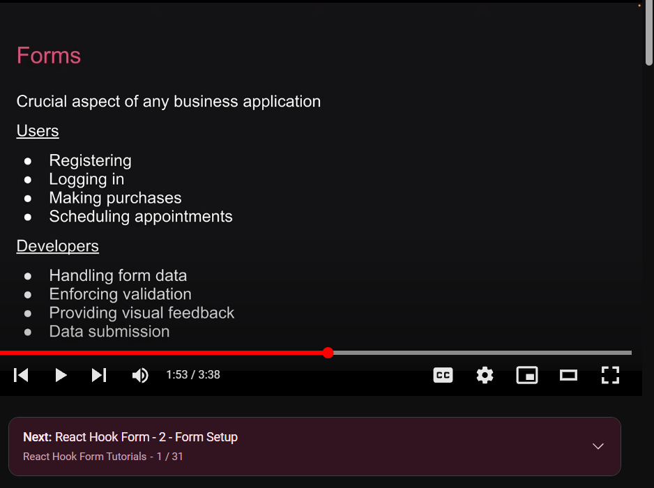
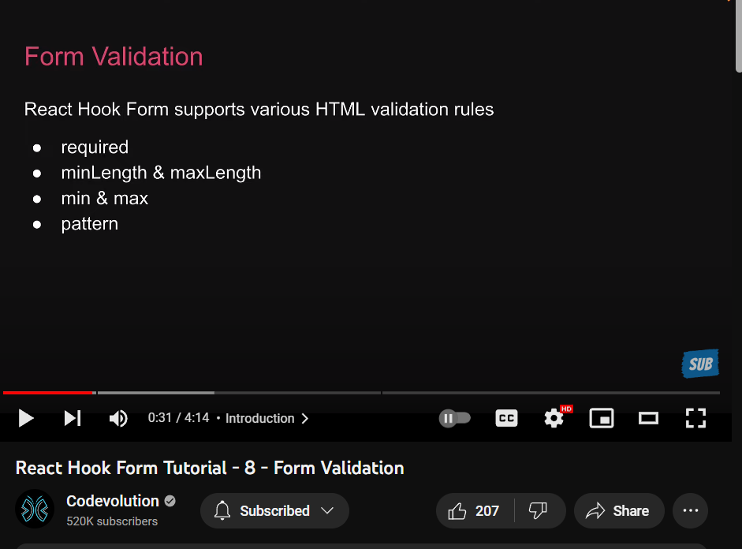

[React hook form](https://www.youtube.com/watch?v=KejZXxFCe2k&list=PLC3y8-rFHvwjmgBr1327BA5bVXoQH-w5s&index=1)

1. small library.why manage,submit,enforce and provide visual feedback.
2. html,css,javascript react fundanmentals. 

# 8)Form validation
